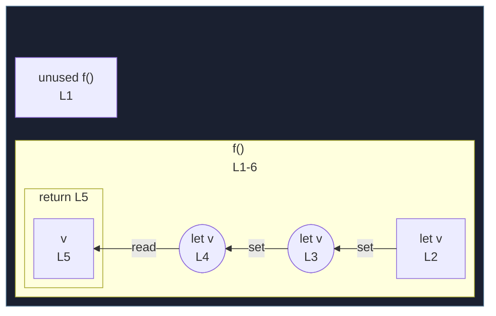

# integration/fixtures/function-let/input.ts

## Input

```ts
function f() {
  let v = 0;
  v = 1;
  v = 2;
  return v;
}
```

## Mermaid


```mermaid
%%{init: {"flowchart": {"defaultRenderer": "elk"}}}%%
flowchart RL
  subgraph wrap_s_scope_1[" "]
    direction TB
    n_scope_0_f_9["unused f()<br/>L1"]
    subgraph s_scope_1["f()<br/>L1-6"]
      direction RL
      n_scope_1_v_21["let v<br/>L2"]
      wr_ref_0(["let v<br/>L3"])
      wr_ref_1(["let v<br/>L4"])
      subgraph s_return_scope_0_f_9["return L5"]
        direction RL
        ret_use_ref_2["v<br/>L5"]
      end
    end
  end
  n_scope_1_v_21 -->|set| wr_ref_0
  wr_ref_0 -->|set| wr_ref_1
  wr_ref_1 -->|read| ret_use_ref_2
  classDef fnWrap fill:#1a2030,stroke:#5a7d99;
  class wrap_s_scope_1 fnWrap;
```
