# integration/fixtures/function-multi-return-shorthand/input.ts

## Input

```ts
function main() {
  const a = "a";

  if (Math.random() < 0.5) {
    const b = "b0";
    return { a, b };
  }

  const b = "b1";
  return { a, b };
}
```

## Mermaid

```mermaid
%%{init: {"flowchart": {"defaultRenderer": "elk"}}}%%
flowchart RL
  subgraph wrap_s_scope_1[" "]
    direction TB
    n_scope_0_main_9["unused main()<br/>L1"]
    subgraph s_scope_1["main()<br/>L1-11"]
      direction RL
      n_scope_1_a_26["a<br/>L2"]
      n_scope_1_b_119["b<br/>L9"]
      subgraph s_scope_2["if L4-7"]
        direction RL
        if_test_scope_1_38{"if<br/>L4"}
        n_scope_2_b_75["b<br/>L5"]
        subgraph s_return_scope_0_main_9_89_105["return L6"]
          direction RL
          ret_use_ref_1["a<br/>L6"]
          ret_use_ref_2["b<br/>L6"]
        end
      end
      subgraph s_return_scope_0_main_9_131_147["return L10"]
        direction RL
        ret_use_ref_3["a<br/>L10"]
        ret_use_ref_4["b<br/>L10"]
      end
    end
  end
  n_scope_1_a_26 -->|read| ret_use_ref_1
  n_scope_2_b_75 -->|read| ret_use_ref_2
  n_scope_1_a_26 -->|read| ret_use_ref_3
  n_scope_1_b_119 -->|read| ret_use_ref_4
  classDef fnWrap fill:#1a2030,stroke:#5a7d99;
  class wrap_s_scope_1 fnWrap;
```


