# integration/fixtures/function-switch-grouped-cases/input.ts

## Input

```ts
function getDayType(day) {
  let ret = "";
  switch (day.toLowerCase()) {
    case "mon":
    case "tue":
    case "wed":
    case "thu":
    case "fri":
      ret = "weekday";
      break;
    case "sat":
    case "sun":
      ret = "weekend";
      break;
    default:
      ret = null;
      break;
  }
  return ret;
}
```

## Mermaid

```mermaid
%%{init: {"flowchart": {"defaultRenderer": "elk"}}}%%
flowchart RL
  subgraph wrap_s_scope_1[" "]
    direction TB
    n_scope_0_getDayType_9["unused getDayType()<br/>L1"]
    subgraph s_scope_1["getDayType()<br/>L1"]
      direction RL
      return_scope_0_getDayType_9((return))
      n_scope_1_day_20["day<br/>L1"]
      n_scope_1_ret_33["let ret<br/>L2"]
      subgraph s_scope_2["switch L3"]
        direction RL
        subgraph s_scope_3["case &quot;mon&quot; L4"]
          direction RL
        end
        subgraph s_scope_4["case &quot;tue&quot; L5"]
          direction RL
        end
        subgraph s_scope_5["case &quot;wed&quot; L6"]
          direction RL
        end
        subgraph s_scope_6["case &quot;thu&quot; L7"]
          direction RL
        end
        subgraph s_scope_7["case &quot;fri&quot; L8"]
          direction RL
          wr_ref_1(["let ret<br/>L9"])
        end
        subgraph s_scope_8["case &quot;sat&quot; L11"]
          direction RL
        end
        subgraph s_scope_9["case &quot;sun&quot; L12"]
          direction RL
          wr_ref_2(["let ret<br/>L13"])
        end
        subgraph s_scope_10["default L15"]
          direction RL
          wr_ref_3(["let ret<br/>L16"])
        end
      end
    end
  end
  n_scope_1_ret_33 -->|fallthrough| wr_ref_1
  n_scope_1_ret_33 -->|fallthrough| wr_ref_2
  n_scope_1_ret_33 -->|set| wr_ref_3
  n_scope_1_day_20 -->|read| s_scope_2
  wr_ref_1 -->|read| return_scope_0_getDayType_9
  wr_ref_2 -->|read| return_scope_0_getDayType_9
  wr_ref_3 -->|read| return_scope_0_getDayType_9
  classDef fnWrap fill:#1a2030,stroke:#5a7d99;
  class wrap_s_scope_1 fnWrap;
```


