# integration/fixtures/function/arrow/callback-result-edge/input.ts

## Input

```ts
const items = [1, 2, 3];

const ids = items.map((v) => v + 1);

const out = run((v) => v - 1);

function run(cb: (n: number) => number) {
  return cb(0);
}
```

## Mermaid

```mermaid
%%{init: {"flowchart": {"defaultRenderer": "elk"}}}%%
flowchart RL
  n_scope_0_items_6["items<br/>L1"]
  n_scope_0_ids_32["unused ids<br/>L3"]
  n_scope_0_out_70["unused out<br/>L5"]
  subgraph s_scope_1["items.map(args[0])<br/>L3"]
    direction RL
    n_scope_1_v_49["v<br/>L3"]
    subgraph s_return_scope_1_55_60["return L3"]
      direction RL
      ret_use_ref_3["v<br/>L3"]
    end
  end
  subgraph s_scope_2["run(args[0])<br/>L5"]
    direction RL
    n_scope_2_v_81["v<br/>L5"]
    subgraph s_return_scope_2_87_92["return L5"]
      direction RL
      ret_use_ref_6["v<br/>L5"]
    end
  end
  subgraph wrap_s_scope_3[" "]
    direction TB
    n_scope_0_run_105["run()<br/>L7"]
    subgraph s_scope_3["run()<br/>L7-9"]
      direction RL
      n_scope_3_cb_109["cb<br/>L7"]
      subgraph s_return_scope_0_run_105_140_153["return L8"]
        direction RL
        ret_use_ref_7["cb<br/>L8"]
      end
    end
  end
  n_scope_0_items_6 -->|read| n_scope_0_ids_32
  n_scope_1_v_49 -->|read| ret_use_ref_3
  n_scope_0_run_105 -->|read,call| n_scope_0_out_70
  n_scope_2_v_81 -->|read| ret_use_ref_6
  n_scope_3_cb_109 -->|read,call| ret_use_ref_7
  s_scope_1 -->|map| n_scope_0_ids_32
  s_scope_2 -->|run| n_scope_0_out_70
  classDef nestL1 fill:#11192a,stroke:transparent;
  class s_scope_1 nestL1;
  class s_scope_2 nestL1;
  class wrap_s_scope_3 nestL1;
  classDef nestL2 fill:#1a2538,stroke:transparent;
  class s_return_scope_1_55_60 nestL2;
  class s_return_scope_2_87_92 nestL2;
  class s_scope_3 nestL2;
  classDef nestL3 fill:#243047,stroke:transparent;
  class s_return_scope_0_run_105_140_153 nestL3;
```


