# integration/fixtures/function/arrow/conditional-body/input.ts

## Input

```ts
const left = "L";
const right = "R";

const pick = (enabled: boolean) => (enabled ? left : right);

const result = pick(true);
```

## Mermaid

```mermaid
%%{init: {"flowchart": {"defaultRenderer": "elk"}}}%%
flowchart RL
  n_scope_0_left_6["left<br/>L1"]
  n_scope_0_right_24["right<br/>L2"]
  n_scope_0_result_106["unused result<br/>L6"]
  subgraph wrap_s_scope_1[" "]
    direction TB
    n_scope_0_pick_44["pick()<br/>L4"]
    subgraph s_scope_1["pick()<br/>L4"]
      direction RL
      n_scope_1_enabled_52["enabled<br/>L4"]
      subgraph cont_ternary_scope_1_74["ternary ?: L4"]
        direction RL
        subgraph s_scope_2["? then L4"]
          direction RL
          ternary_test_scope_1_74{"ternary ?:<br/>L4"}
        end
        subgraph s_scope_3[": else L4"]
          direction RL
          elk_empty_s_scope_3["No nodes"]
        end
      end
      subgraph s_return_scope_0_pick_44_73_97["return L4"]
        direction RL
        ret_use_ref_4["left<br/>L4"]
        ret_use_ref_5["right<br/>L4"]
      end
    end
  end
  n_scope_1_enabled_52 -->|read| ternary_test_scope_1_74
  n_scope_0_left_6 -->|read| ret_use_ref_4
  n_scope_0_right_24 -->|read| ret_use_ref_5
  n_scope_0_pick_44 -->|read,call| n_scope_0_result_106
  classDef nestL1 fill:#11192a,stroke:transparent;
  class wrap_s_scope_1 nestL1;
  classDef nestL2 fill:#1a2538,stroke:transparent;
  class s_scope_1 nestL2;
  classDef nestL3 fill:#243047,stroke:transparent;
  class cont_ternary_scope_1_74 nestL3;
  class s_return_scope_0_pick_44_73_97 nestL3;
  classDef nestL4 fill:#2d3b57,stroke:transparent;
  class s_scope_2 nestL4;
  class s_scope_3 nestL4;
  classDef elkEmptyPlaceholder fill:transparent,stroke:transparent;
  class elk_empty_s_scope_3 elkEmptyPlaceholder;
```


