# integration/fixtures/function/arrow/const-ret-conditional/input.ts

## Input

```ts
function pick(expr: boolean) {
  const a = "a";
  const b = "b";
  const ret = expr ? a : b;
  return ret;
}

const result = pick(true);
```

## Mermaid

```mermaid
%%{init: {"flowchart": {"defaultRenderer": "elk"}}}%%
flowchart RL
  n_scope_0_result_116["unused result<br/>L8"]
  subgraph wrap_s_scope_1[" "]
    direction TB
    n_scope_0_pick_9["pick()<br/>L1"]
    subgraph s_scope_1["pick()<br/>L1-6"]
      direction RL
      n_scope_1_expr_14["expr<br/>L1"]
      n_scope_1_a_39["a<br/>L2"]
      n_scope_1_b_56["b<br/>L3"]
      n_scope_1_ret_73["ret<br/>L4"]
      subgraph cont_ternary_scope_1_79["ternary ?: L4"]
        direction RL
        subgraph s_scope_2["? then L4"]
          direction RL
          ternary_test_scope_1_79{"ternary ?:<br/>L4"}
        end
        subgraph s_scope_3[": else L4"]
          direction RL
          elk_empty_s_scope_3["No nodes"]
        end
      end
      subgraph s_return_scope_0_pick_9_95_106["return L5"]
        direction RL
        ret_use_ref_6["ret<br/>L5"]
      end
    end
  end
  n_scope_1_expr_14 -->|read| ternary_test_scope_1_79
  n_scope_1_a_39 -->|read| n_scope_1_ret_73
  n_scope_1_b_56 -->|read| n_scope_1_ret_73
  n_scope_1_ret_73 -->|read| ret_use_ref_6
  n_scope_0_pick_9 -->|read,call| n_scope_0_result_116
  classDef nestL1 fill:#11192a,stroke:transparent;
  class wrap_s_scope_1 nestL1;
  classDef nestL2 fill:#1a2538,stroke:transparent;
  class s_scope_1 nestL2;
  classDef nestL3 fill:#243047,stroke:transparent;
  class cont_ternary_scope_1_79 nestL3;
  class s_return_scope_0_pick_9_95_106 nestL3;
  classDef nestL4 fill:#2d3b57,stroke:transparent;
  class s_scope_2 nestL4;
  class s_scope_3 nestL4;
  classDef elkEmptyPlaceholder fill:transparent,stroke:transparent;
  class elk_empty_s_scope_3 elkEmptyPlaceholder;
```


