# integration/fixtures/function/arrow/return-iife-conditional/input.ts

## Input

```ts
function pick(flag: boolean) {
  const left = "yes";
  const right = "no";
  return (() => {
    return flag ? left : right;
  })();
}

const result = pick(true);
```

## Mermaid

```mermaid
%%{init: {"flowchart": {"defaultRenderer": "elk"}}}%%
flowchart RL
  n_scope_0_result_142["unused result<br/>L9"]
  subgraph wrap_s_scope_1[" "]
    direction TB
    n_scope_0_pick_9["pick()<br/>L1"]
    subgraph s_scope_1["pick()<br/>L1-7"]
      direction RL
      n_scope_1_flag_14["flag<br/>L1"]
      n_scope_1_left_39["left<br/>L2"]
      n_scope_1_right_61["right<br/>L3"]
      subgraph s_scope_2["(anonymous)<br/>L4-6"]
        direction RL
        subgraph cont_ternary_scope_2_104["ternary ?: L5"]
          direction RL
          subgraph s_scope_3["? then L5"]
            direction RL
            ternary_test_scope_2_104{"ternary ?:<br/>L5"}
          end
          subgraph s_scope_4[": else L5"]
            direction RL
            elk_empty_s_scope_4["No nodes"]
          end
        end
        subgraph s_return_scope_0_pick_9_97_124["return L5"]
          direction RL
          ret_use_ref_3["left<br/>L5"]
          ret_use_ref_4["right<br/>L5"]
        end
      end
    end
  end
  n_scope_1_flag_14 -->|read| ternary_test_scope_2_104
  n_scope_1_left_39 -->|read| ret_use_ref_3
  n_scope_1_right_61 -->|read| ret_use_ref_4
  n_scope_0_pick_9 -->|read,call| n_scope_0_result_142
  classDef nestL1 fill:#11192a,stroke:transparent;
  class wrap_s_scope_1 nestL1;
  classDef nestL2 fill:#1a2538,stroke:transparent;
  class s_scope_1 nestL2;
  classDef nestL3 fill:#243047,stroke:transparent;
  class s_scope_2 nestL3;
  classDef nestL4 fill:#2d3b57,stroke:transparent;
  class cont_ternary_scope_2_104 nestL4;
  class s_return_scope_0_pick_9_97_124 nestL4;
  classDef nestL5 fill:#364666,stroke:transparent;
  class s_scope_3 nestL5;
  class s_scope_4 nestL5;
  classDef elkEmptyPlaceholder fill:transparent,stroke:transparent;
  class elk_empty_s_scope_4 elkEmptyPlaceholder;
```


