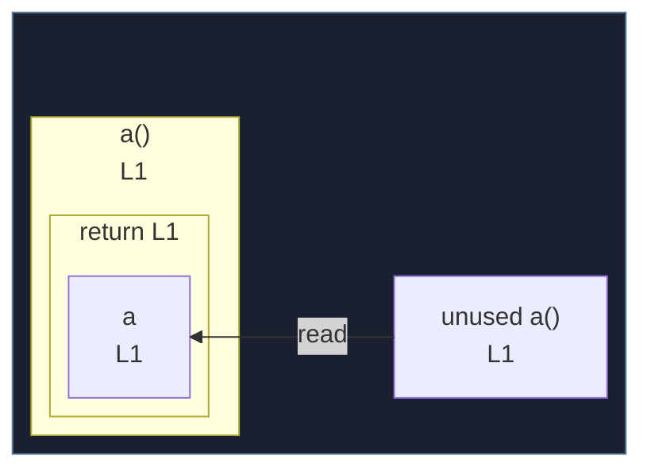

# integration/fixtures/function/arrow/self-recursive-only/input.ts

## Input

```ts
const a = () => a;
```

## Mermaid


```mermaid
%%{init: {"flowchart": {"defaultRenderer": "elk"}}}%%
flowchart RL
  subgraph wrap_s_scope_1[" "]
    direction TB
    n_scope_0_a_6["unused a()<br/>L1"]
    subgraph s_scope_1["a()<br/>L1"]
      direction RL
      subgraph s_return_scope_0_a_6_16_17["return L1"]
        direction RL
        ret_use_ref_1["a<br/>L1"]
      end
    end
  end
  n_scope_0_a_6 -->|read| ret_use_ref_1
  classDef fnWrap fill:#1a2030,stroke:#5a7d99;
  class wrap_s_scope_1 fnWrap;
```
