# integration/fixtures/function/declaration/conditional-return/input.ts

## Input

```ts
function pick(flag: boolean) {
  const left = "yes";
  const right = "no";
  return flag ? left : right;
}

const result = pick(true);
```

## Mermaid

```mermaid
%%{init: {"flowchart": {"defaultRenderer": "elk"}}}%%
flowchart RL
  n_scope_0_result_114["unused result<br/>L7"]
  subgraph wrap_s_scope_1[" "]
    direction TB
    n_scope_0_pick_9["pick()<br/>L1"]
    subgraph s_scope_1["pick()<br/>L1-5"]
      direction RL
      n_scope_1_flag_14["flag<br/>L1"]
      n_scope_1_left_39["left<br/>L2"]
      n_scope_1_right_61["right<br/>L3"]
      subgraph s_return_scope_0_pick_9_77_104["return L4"]
        direction RL
        ret_use_ref_2["flag<br/>L4"]
        ret_use_ref_3["left<br/>L4"]
        ret_use_ref_4["right<br/>L4"]
      end
    end
  end
  n_scope_1_flag_14 -->|read| ret_use_ref_2
  n_scope_1_left_39 -->|read| ret_use_ref_3
  n_scope_1_right_61 -->|read| ret_use_ref_4
  n_scope_0_pick_9 -->|read,call| n_scope_0_result_114
  classDef nestL1 fill:#11192a,stroke:transparent;
  class wrap_s_scope_1 nestL1;
  classDef nestL2 fill:#1a2538,stroke:transparent;
  class s_scope_1 nestL2;
  classDef nestL3 fill:#243047,stroke:transparent;
  class s_return_scope_0_pick_9_77_104 nestL3;
```


