# integration/fixtures/function/declaration/object-pattern-parameter/input.ts

## Input

```ts
function f({ a, b }: { a: number; b: number }) {
  return a + b;
}

const result = f({ a: 1, b: 2 });
```

## Mermaid

```mermaid
%%{init: {"flowchart": {"defaultRenderer": "elk"}}}%%
flowchart RL
  n_scope_0_result_74["unused result<br/>L5"]
  subgraph wrap_s_scope_1[" "]
    direction TB
    n_scope_0_f_9["f()<br/>L1"]
    subgraph s_scope_1["f()<br/>L1-3"]
      direction RL
      n_scope_1_a_13["a<br/>L1"]
      n_scope_1_b_16["b<br/>L1"]
      subgraph s_return_scope_0_f_9_51_64["return L2"]
        direction RL
        ret_use_ref_0["a<br/>L2"]
        ret_use_ref_1["b<br/>L2"]
      end
    end
  end
  n_scope_1_a_13 -->|read| ret_use_ref_0
  n_scope_1_b_16 -->|read| ret_use_ref_1
  n_scope_0_f_9 -->|read,call| n_scope_0_result_74
  classDef nestL1 fill:#11192a,stroke:transparent;
  class wrap_s_scope_1 nestL1;
  classDef nestL2 fill:#1a2538,stroke:transparent;
  class s_scope_1 nestL2;
  classDef nestL3 fill:#243047,stroke:transparent;
  class s_return_scope_0_f_9_51_64 nestL3;
```


