# integration/fixtures/function/declaration/read-chain/input.ts

## Input

```ts
function f() {
  const a = "a";
  const b = [a];
  const c = { value: b };
  const d = c;
  return d;
}

const g = f();
const h = [g];
```

## Mermaid

```mermaid
%%{init: {"flowchart": {"defaultRenderer": "elk"}}}%%
flowchart RL
  n_scope_0_g_111["g<br/>L9"]
  n_scope_0_h_126["unused h<br/>L10"]
  subgraph wrap_s_scope_1[" "]
    direction TB
    n_scope_0_f_9["f()<br/>L1"]
    subgraph s_scope_1["f()<br/>L1-7"]
      direction RL
      n_scope_1_a_23["a<br/>L2"]
      n_scope_1_b_40["b<br/>L3"]
      n_scope_1_c_57["c<br/>L4"]
      n_scope_1_d_83["d<br/>L5"]
      subgraph s_return_scope_0_f_9_92_101["return L6"]
        direction RL
        ret_use_ref_7["d<br/>L6"]
      end
    end
  end
  n_scope_1_a_23 -->|read| n_scope_1_b_40
  n_scope_1_b_40 -->|read| n_scope_1_c_57
  n_scope_1_c_57 -->|read| n_scope_1_d_83
  n_scope_1_d_83 -->|read| ret_use_ref_7
  n_scope_0_f_9 -->|read,call| n_scope_0_g_111
  n_scope_0_g_111 -->|read| n_scope_0_h_126
  classDef nestL1 fill:#11192a,stroke:transparent;
  class wrap_s_scope_1 nestL1;
  classDef nestL2 fill:#1a2538,stroke:transparent;
  class s_scope_1 nestL2;
  classDef nestL3 fill:#243047,stroke:transparent;
  class s_return_scope_0_f_9_92_101 nestL3;
```


