# integration/fixtures/function/declaration/var-binding/input.ts

## Notice

```
uns: warning: L2:2: var declaration detected; rendered as node only (no edges).
```

## Input

```ts
function f() {
  var x = 1;
  return x;
}

const g = f();
```

## Mermaid

```mermaid
%%{init: {"flowchart": {"defaultRenderer": "elk"}}}%%
flowchart RL
  n_scope_0_g_49["unused g<br/>L6"]
  subgraph wrap_s_scope_1[" "]
    direction TB
    n_scope_0_f_9["f()<br/>L1"]
    subgraph s_scope_1["f()<br/>L1-4"]
      direction RL
      n_scope_1_x_21["var x<br/>L2"]
    end
  end
  n_scope_0_f_9 -->|read,call| n_scope_0_g_49
  classDef varNode stroke-dasharray:5 5;
  class n_scope_1_x_21 varNode;
  classDef nestL1 fill:#11192a,stroke:transparent;
  class wrap_s_scope_1 nestL1;
  classDef nestL2 fill:#1a2538,stroke:transparent;
  class s_scope_1 nestL2;
```


