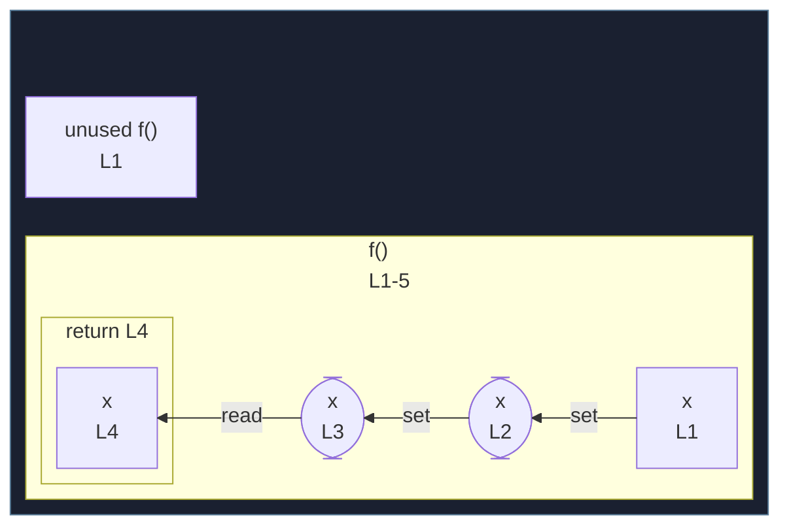

# integration/fixtures/function/expression/parameter-reassignment/input.ts

## Input

```ts
const f = function (x: number) {
  x = x + 1;
  x = x * 2;
  return x;
};
```

## Mermaid


```mermaid
%%{init: {"flowchart": {"defaultRenderer": "elk"}}}%%
flowchart RL
  subgraph wrap_s_scope_1[" "]
    direction TB
    n_scope_0_f_6["unused f()<br/>L1"]
    subgraph s_scope_1["f()<br/>L1-5"]
      direction RL
      n_scope_1_x_20["x<br/>L1"]
      wr_ref_1(["x<br/>L2"])
      wr_ref_3(["x<br/>L3"])
      subgraph s_return_scope_0_f_6_61_70["return L4"]
        direction RL
        ret_use_ref_5["x<br/>L4"]
      end
    end
  end
  n_scope_1_x_20 -->|set| wr_ref_1
  wr_ref_1 -->|set| wr_ref_3
  wr_ref_3 -->|read| ret_use_ref_5
  classDef fnWrap fill:#1a2030,stroke:#5a7d99;
  class wrap_s_scope_1 fnWrap;
```
