# integration/fixtures/function/expression/returned-from-function/input.ts

## Input

```ts
function f(a: number) {
  return function () {
    return a;
  };
}

const g = f(0);
const v = g();
```

## Mermaid

```mermaid
%%{init: {"flowchart": {"defaultRenderer": "elk"}}}%%
flowchart RL
  n_scope_0_g_75["g<br/>L7"]
  n_scope_0_v_91["unused v<br/>L8"]
  subgraph wrap_s_scope_1[" "]
    direction TB
    n_scope_0_f_9["f()<br/>L1"]
    subgraph s_scope_1["f()<br/>L1-5"]
      direction RL
      n_scope_1_a_11["a<br/>L1"]
      subgraph s_scope_2["(anonymous)<br/>L2-4"]
        direction RL
        subgraph s_return_scope_0_f_9_51_60["return L3"]
          direction RL
          ret_use_ref_0["a<br/>L3"]
        end
      end
    end
  end
  n_scope_1_a_11 -->|read| ret_use_ref_0
  n_scope_0_f_9 -->|read,call| n_scope_0_g_75
  n_scope_0_g_75 -->|read,call| n_scope_0_v_91
  classDef nestL1 fill:#11192a,stroke:transparent;
  class wrap_s_scope_1 nestL1;
  classDef nestL2 fill:#1a2538,stroke:transparent;
  class s_scope_1 nestL2;
  classDef nestL3 fill:#243047,stroke:transparent;
  class s_scope_2 nestL3;
  classDef nestL4 fill:#2d3b57,stroke:transparent;
  class s_return_scope_0_f_9_51_60 nestL4;
```


