# integration/fixtures/if-statement/with-else/input.ts

## Input

```ts
let counter = 0;
const flag = true;

if (flag) {
  counter = 1;
} else {
  counter = 2;
}

const result = counter;
```

## Query

```sh
-r counter -A 2 -B 0
```

## Mermaid

```mermaid
%%{init: {"flowchart": {"defaultRenderer": "elk"}}}%%
flowchart RL
  %% pruning roots counter=1 ancestors=0 descendants=2
  n_scope_0_counter_4["let counter<br/>L1"]
  n_scope_0_result_97["unused result<br/>L10"]
  subgraph cont_if_scope_0_37["if-else L4-8"]
    direction RL
    subgraph s_scope_1["if L4-6"]
      direction RL
      wr_ref_3(["let counter<br/>L5"])
    end
    subgraph s_scope_2["else L6-8"]
      direction RL
      wr_ref_4(["let counter<br/>L7"])
    end
  end
  n_scope_0_counter_4 -->|set| wr_ref_3
  n_scope_0_counter_4 -->|set| wr_ref_4
  wr_ref_3 -->|read| n_scope_0_result_97
  wr_ref_4 -->|read| n_scope_0_result_97
  classDef nestL1 fill:#1e2738,stroke:#3d4a63;
  class cont_if_scope_0_37 nestL1;
  classDef nestL2 fill:#233045,stroke:#475670;
  class s_scope_1 nestL2;
  class s_scope_2 nestL2;
```


