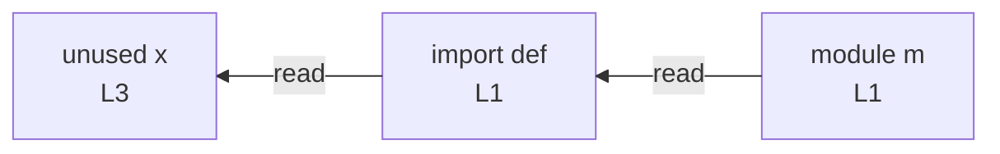

# integration/fixtures/imports/default-only/input.ts

## Input

```ts
import def from "m";

const x = def;
```

## Mermaid


```mermaid
%%{init: {"flowchart": {"defaultRenderer": "elk"}}}%%
flowchart RL
  n_scope_0_def_7["import def<br/>L1"]
  n_scope_0_x_28["unused x<br/>L3"]
  n_scope_0_def_7 -->|read| n_scope_0_x_28
  mod_m["module m<br/>L1"]
  mod_m -->|read| n_scope_0_def_7
```
