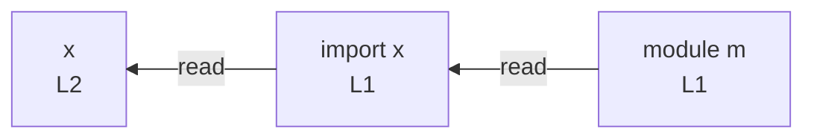

# integration/fixtures/imports/named-mjs/input.mjs

## Input

```js
import { x } from "m";
x;
```

## Mermaid


```mermaid
%%{init: {"flowchart": {"defaultRenderer": "elk"}}}%%
flowchart RL
  n_scope_0_x_9["import x<br/>L1"]
  n_scope_0_x_9 -->|read| expr_stmt_23
  expr_stmt_23["x<br/>L2"]
  mod_m["module m<br/>L1"]
  mod_m -->|read| n_scope_0_x_9
```
