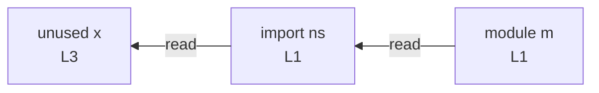

# integration/fixtures/imports/namespace-only/input.ts

## Input

```ts
import * as ns from "m";

const x = ns;
```

## Mermaid


```mermaid
%%{init: {"flowchart": {"defaultRenderer": "elk"}}}%%
flowchart RL
  n_scope_0_ns_12["import ns<br/>L1"]
  n_scope_0_x_32["unused x<br/>L3"]
  n_scope_0_ns_12 -->|read| n_scope_0_x_32
  mod_m["module m<br/>L1"]
  mod_m -->|read| n_scope_0_ns_12
```
