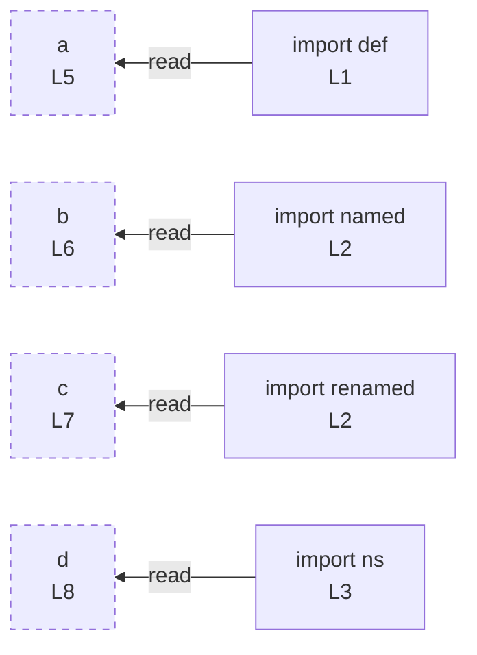

# imports

## Input (`input.ts`)

```ts
import def from "some-default";
import { named, other as renamed } from "some-named";
import * as ns from "some-namespace";

const a = def;
const b = named;
const c = renamed;
const d = ns;
```

## Mermaid


