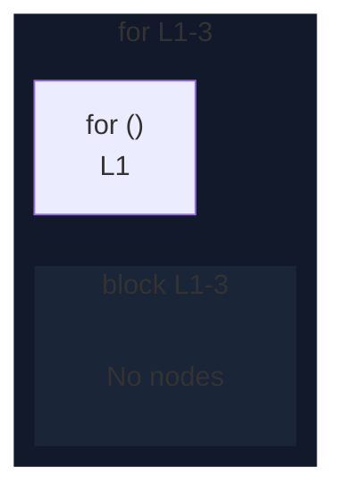

# integration/fixtures/iteration-statement/classic-for/all-clauses-omitted/input.ts

## Input

```ts
for (;;) {
  break;
}
```

## Mermaid


```mermaid
%%{init: {"flowchart": {"defaultRenderer": "elk"}}}%%
flowchart RL
  subgraph s_scope_1["for L1-3"]
    direction RL
    for_test_scope_0_0["for ()<br/>L1"]
    subgraph s_scope_2["block L1-3"]
      direction RL
      elk_empty_s_scope_2["No nodes"]
    end
  end
  classDef nestL1 fill:#11192a,stroke:transparent;
  class s_scope_1 nestL1;
  classDef nestL2 fill:#1a2538,stroke:transparent;
  class s_scope_2 nestL2;
  classDef elkEmptyPlaceholder fill:transparent,stroke:transparent;
  class elk_empty_s_scope_2 elkEmptyPlaceholder;
```
