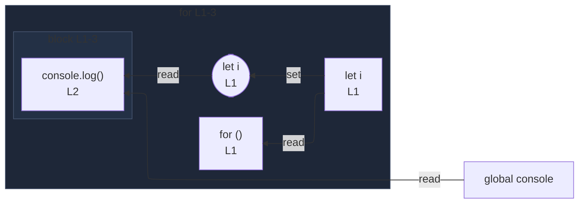

# integration/fixtures/iteration-statement/classic-for/basic-let-counter/input.ts

## Input

```ts
for (let i = 0; i < 3; i++) {
  console.log(i);
}
```

## Mermaid


```mermaid
%%{init: {"flowchart": {"defaultRenderer": "elk"}}}%%
flowchart RL
  n_scope_0_console_32["global console"]
  subgraph s_scope_1["for L1-3"]
    direction RL
    for_test_scope_0_0["for ()<br/>L1"]
    n_scope_1_i_9["let i<br/>L1"]
    wr_ref_2(["let i<br/>L1"])
    subgraph s_scope_2["block L1-3"]
      direction RL
      expr_stmt_32["console.log()<br/>L2"]
    end
  end
  n_scope_1_i_9 -->|set| wr_ref_2
  n_scope_1_i_9 -->|read| for_test_scope_0_0
  n_scope_0_console_32 -->|read| expr_stmt_32
  wr_ref_2 -->|read| expr_stmt_32
  classDef nestL1 fill:#1e2738,stroke:#3d4a63;
  class s_scope_1 nestL1;
  classDef nestL2 fill:#233045,stroke:#475670;
  class s_scope_2 nestL2;
```
