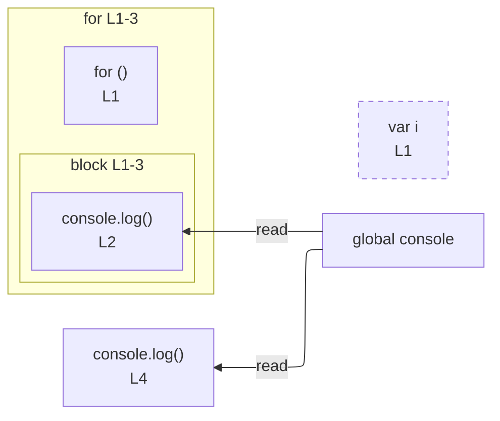

# integration/fixtures/iteration-statement/classic-for/basic-var-counter/input.ts

## Notice

```
uns: warning: L1:5: var declaration detected; rendered as node only (no edges).
```

## Input

```ts
for (var i = 0; i < 3; i++) {
  console.log(i);
}
console.log(i);
```

## Mermaid


