# integration/fixtures/iteration-statement/classic-for/closure-let-binding/input.ts

## Input

```ts
const fns: (() => number)[] = [];
for (let q = 0; q < 3; q++) {
  fns.push(() => q);
}
console.log(fns.length);
```

## Mermaid

```mermaid
%%{init: {"flowchart": {"defaultRenderer": "elk"}}}%%
flowchart RL
  n_scope_0_fns_6["fns<br/>L1"]
  n_scope_0_console_87["global console"]
  subgraph s_scope_1["for L2-4"]
    direction RL
    for_test_scope_0_34["for ()<br/>L2"]
    n_scope_1_q_43["let q<br/>L2"]
    wr_ref_3(["let q<br/>L2"])
    subgraph s_scope_2["block L2-4"]
      direction RL
      expr_stmt_66["fns.push()<br/>L3"]
      subgraph s_scope_3["(anonymous)<br/>L3"]
        direction RL
        elk_empty_s_scope_3["No nodes"]
      end
    end
  end
  n_scope_1_q_43 -->|set| wr_ref_3
  n_scope_1_q_43 -->|read| for_test_scope_0_34
  n_scope_0_fns_6 -->|read| expr_stmt_66
  wr_ref_3 -->|read| expr_stmt_66
  n_scope_0_console_87 -->|read| expr_stmt_87
  n_scope_0_fns_6 -->|read| expr_stmt_87
  expr_stmt_87["console.log()<br/>L5"]
  classDef nestL1 fill:#11192a,stroke:transparent;
  class s_scope_1 nestL1;
  classDef nestL2 fill:#1a2538,stroke:transparent;
  class s_scope_2 nestL2;
  classDef nestL3 fill:#243047,stroke:transparent;
  class s_scope_3 nestL3;
  classDef elkEmptyPlaceholder fill:transparent,stroke:transparent;
  class elk_empty_s_scope_3 elkEmptyPlaceholder;
```


