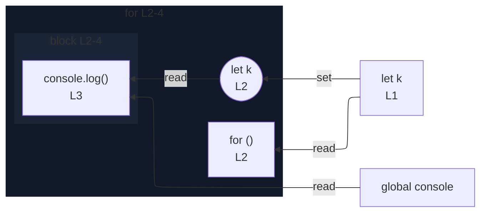

# integration/fixtures/iteration-statement/classic-for/init-omitted/input.ts

## Input

```ts
let k = 0;
for (; k < 3; k++) {
  console.log(k);
}
```

## Mermaid


```mermaid
%%{init: {"flowchart": {"defaultRenderer": "elk"}}}%%
flowchart RL
  n_scope_0_k_4["let k<br/>L1"]
  n_scope_0_console_34["global console"]
  subgraph s_scope_1["for L2-4"]
    direction RL
    for_test_scope_0_11["for ()<br/>L2"]
    wr_ref_2(["let k<br/>L2"])
    subgraph s_scope_2["block L2-4"]
      direction RL
      expr_stmt_34["console.log()<br/>L3"]
    end
  end
  n_scope_0_k_4 -->|set| wr_ref_2
  n_scope_0_k_4 -->|read| for_test_scope_0_11
  n_scope_0_console_34 -->|read| expr_stmt_34
  wr_ref_2 -->|read| expr_stmt_34
  classDef nestL1 fill:#11192a,stroke:transparent;
  class s_scope_1 nestL1;
  classDef nestL2 fill:#1a2538,stroke:transparent;
  class s_scope_2 nestL2;
```
