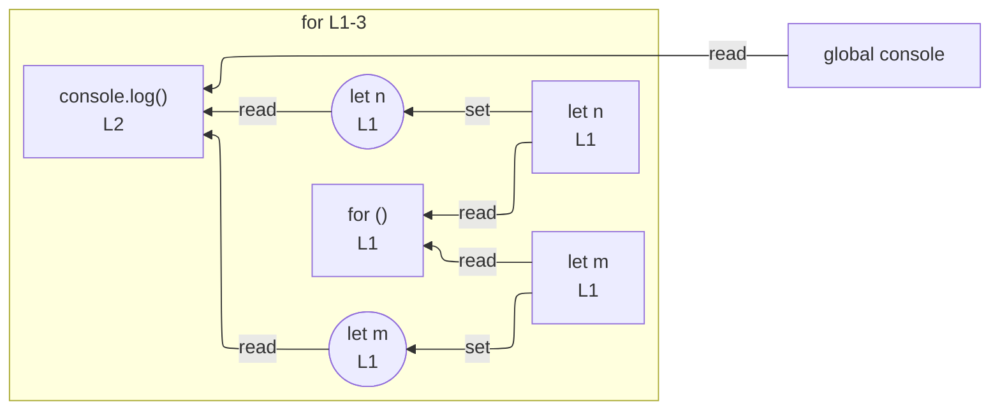

# integration/fixtures/iteration-statement/classic-for/multiple-declarators/input.ts

## Input

```ts
for (let m = 0, n = 10; m < n; m++, n--) {
  console.log(m, n);
}
```

## Mermaid


```mermaid
%%{init: {"flowchart": {"defaultRenderer": "elk"}}}%%
flowchart RL
  n_scope_0_console_45["global console"]
  subgraph s_scope_1["for L1-3"]
    direction RL
    for_test_scope_0_0["for ()<br/>L1"]
    n_scope_1_m_9["let m<br/>L1"]
    n_scope_1_n_16["let n<br/>L1"]
    wr_ref_4(["let m<br/>L1"])
    wr_ref_5(["let n<br/>L1"])
    expr_stmt_45["console.log()<br/>L2"]
  end
  n_scope_1_m_9 -->|set| wr_ref_4
  n_scope_1_n_16 -->|set| wr_ref_5
  n_scope_1_m_9 -->|read| for_test_scope_0_0
  n_scope_1_n_16 -->|read| for_test_scope_0_0
  n_scope_0_console_45 -->|read| expr_stmt_45
  wr_ref_4 -->|read| expr_stmt_45
  wr_ref_5 -->|read| expr_stmt_45
```
