# integration/fixtures/iteration-statement/do-while/basic/input.ts

## Input

```ts
const limit = 10;
let count = 0;
do {
  console.log(count);
  count++;
} while (count < limit);
```

## Mermaid

```mermaid
%%{init: {"flowchart": {"defaultRenderer": "elk"}}}%%
flowchart RL
  n_scope_0_limit_6["limit<br/>L1"]
  n_scope_0_count_22["let count<br/>L2"]
  n_scope_0_console_40["global console"]
  subgraph s_scope_1["do-while L3-6"]
    direction RL
    wr_ref_4(["let count<br/>L5"])
    expr_stmt_40["console.log()<br/>L4"]
    do_while_test_scope_0_33["do while ()<br/>L6"]
  end
  n_scope_0_count_22 -->|set| wr_ref_4
  n_scope_0_console_40 -->|read| expr_stmt_40
  n_scope_0_count_22 -->|read| expr_stmt_40
  wr_ref_4 -->|read| do_while_test_scope_0_33
  n_scope_0_limit_6 -->|read| do_while_test_scope_0_33
  classDef nestL1 fill:#11192a,stroke:transparent;
  class s_scope_1 nestL1;
```


