# integration/fixtures/iteration-statement/for-in/var-binding/input.ts

## Notice

```
uns: warning: L2:5: var declaration detected; rendered as node only (no edges).
```

## Input

```ts
const obj = { a: 1, b: 2 };
for (var k in obj) {
  console.log(k, obj[k]);
}
console.log(k);
```

## Mermaid

```mermaid
%%{init: {"flowchart": {"defaultRenderer": "elk"}}}%%
flowchart RL
  n_scope_0_obj_6["obj<br/>L1"]
  n_scope_0_k_37["var k<br/>L2"]
  n_scope_0_console_51["global console"]
  subgraph s_scope_1["for L2-4"]
    direction RL
    for_test_scope_0_28["for ()<br/>L2"]
    subgraph s_scope_2["block L2-4"]
      direction RL
      expr_stmt_51["console.log()<br/>L3"]
    end
  end
  n_scope_0_obj_6 -->|read| for_test_scope_0_28
  n_scope_0_console_51 -->|read| expr_stmt_51
  n_scope_0_obj_6 -->|read| expr_stmt_51
  n_scope_0_console_51 -->|read| expr_stmt_77
  expr_stmt_77["console.log()<br/>L5"]
  classDef varNode stroke-dasharray:5 5;
  class n_scope_0_k_37 varNode;
  classDef nestL1 fill:#11192a,stroke:transparent;
  class s_scope_1 nestL1;
  classDef nestL2 fill:#1a2538,stroke:transparent;
  class s_scope_2 nestL2;
```


