# integration/fixtures/iteration-statement/for-of/nested-destructuring-default/input.ts

## Input

```ts
const records: { meta: { tag?: string } }[] = [
  { meta: {} },
  { meta: { tag: "T" } },
];
for (const {
  meta: { tag = "default" },
} of records) {
  console.log(tag);
}
```

## Mermaid

```mermaid
%%{init: {"flowchart": {"defaultRenderer": "elk"}}}%%
flowchart RL
  n_scope_0_records_6["records<br/>L1"]
  n_scope_0_console_153["global console"]
  subgraph s_scope_1["for L5-9"]
    direction RL
    for_test_scope_0_93["for ()<br/>L5"]
    n_scope_1_tag_116["tag<br/>L6"]
    subgraph s_scope_2["block L7-9"]
      direction RL
      expr_stmt_153["console.log()<br/>L8"]
    end
  end
  n_scope_0_records_6 -->|read| for_test_scope_0_93
  n_scope_0_console_153 -->|read| expr_stmt_153
  n_scope_1_tag_116 -->|read| expr_stmt_153
  classDef nestL1 fill:#11192a,stroke:transparent;
  class s_scope_1 nestL1;
  classDef nestL2 fill:#1a2538,stroke:transparent;
  class s_scope_2 nestL2;
```


