# integration/fixtures/iteration-statement/for-of/var-binding/input.ts

## Notice

```
uns: warning: L2:5: var declaration detected; rendered as node only (no edges).
```

## Input

```ts
const items = [1, 2, 3];
for (var item of items) {
  console.log(item);
}
console.log(item);
```

## Mermaid

```mermaid
%%{init: {"flowchart": {"defaultRenderer": "elk"}}}%%
flowchart RL
  n_scope_0_items_6["items<br/>L1"]
  n_scope_0_item_34["var item<br/>L2"]
  n_scope_0_console_53["global console"]
  subgraph s_scope_1["for L2-4"]
    direction RL
    for_test_scope_0_25["for ()<br/>L2"]
    subgraph s_scope_2["block L2-4"]
      direction RL
      expr_stmt_53["console.log()<br/>L3"]
    end
  end
  n_scope_0_items_6 -->|read| for_test_scope_0_25
  n_scope_0_console_53 -->|read| expr_stmt_53
  n_scope_0_console_53 -->|read| expr_stmt_74
  expr_stmt_74["console.log()<br/>L5"]
  classDef varNode stroke-dasharray:5 5;
  class n_scope_0_item_34 varNode;
  classDef nestL1 fill:#11192a,stroke:transparent;
  class s_scope_1 nestL1;
  classDef nestL2 fill:#1a2538,stroke:transparent;
  class s_scope_2 nestL2;
```


