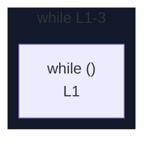

# integration/fixtures/iteration-statement/while/bare-continue/input.ts

## Input

```ts
while (true) {
  if (1) continue;
}
```

## Mermaid


```mermaid
%%{init: {"flowchart": {"defaultRenderer": "elk"}}}%%
flowchart RL
  subgraph s_scope_1["while L1-3"]
    direction RL
    while_test_scope_0_0["while ()<br/>L1"]
  end
  classDef nestL1 fill:#11192a,stroke:transparent;
  class s_scope_1 nestL1;
```
