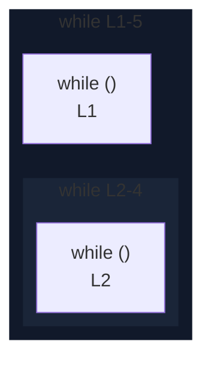

# integration/fixtures/iteration-statement/while/labeled-continue/input.ts

## Input

```ts
outer: while (true) {
  while (true) {
    continue outer;
  }
}
```

## Mermaid


```mermaid
%%{init: {"flowchart": {"defaultRenderer": "elk"}}}%%
flowchart RL
  subgraph s_scope_1["while L1-5"]
    direction RL
    while_test_scope_0_7["while ()<br/>L1"]
    subgraph s_scope_2["while L2-4"]
      direction RL
      while_test_scope_1_24["while ()<br/>L2"]
    end
  end
  classDef nestL1 fill:#11192a,stroke:transparent;
  class s_scope_1 nestL1;
  classDef nestL2 fill:#1a2538,stroke:transparent;
  class s_scope_2 nestL2;
```
