# integration/fixtures/jsx-children-expression/input.tsx

## Input

```tsx
import { Sub } from "./sub";

export function Main() {
  const message = "hello";
  return <Sub>{message}</Sub>;
}
```

## Mermaid

```mermaid
%%{init: {"flowchart": {"defaultRenderer": "elk"}}}%%
flowchart RL
  n_scope_0_Sub_9["import Sub<br/>L1"]
  subgraph wrap_s_scope_1[" "]
    direction TB
    n_scope_0_Main_46["unused Main()<br/>L3"]
    subgraph s_scope_1["Main()<br/>L3-6"]
      direction RL
      n_scope_1_message_63["message<br/>L4"]
      subgraph s_return_scope_0_Main_46_84_112["return L5"]
        direction RL
        ret_use_ref_0["Sub<br/>L5"]
        ret_use_ref_1["message<br/>L5"]
      end
    end
  end
  n_scope_0_Sub_9 -->|read| ret_use_ref_0
  n_scope_1_message_63 -->|read| ret_use_ref_1
  mod___sub["module ./sub<br/>L1"]
  mod___sub -->|read| n_scope_0_Sub_9
  classDef fnWrap fill:#1a2030,stroke:#5a7d99;
  class wrap_s_scope_1 fnWrap;
```


