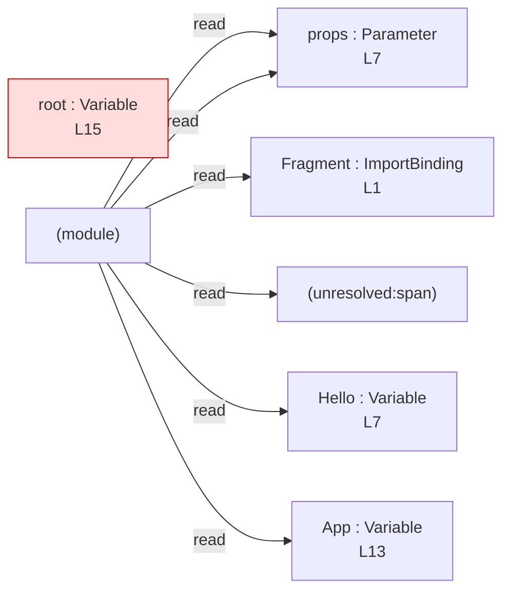

# jsx-component

## Input (`input.tsx`)

```tsx
import { Fragment } from "react";

interface Props {
  label: string;
}

const Hello = (props: Props) => (
  <Fragment>
    <span className="greeting">{props.label}</span>
  </Fragment>
);

const App = () => <Hello label="hi" />;

const root = App;
```

## Mermaid


