# integration/fixtures/jsx/call-statement-component/input.tsx

## Input

```tsx
import { wrap } from "./hoc";
import { Box, Text } from "./ui";

wrap((title: string, body: string) => {
  return (
    <Box label={title}>
      <Text>{body}</Text>
    </Box>
  );
});
```

## Mermaid

```mermaid
%%{init: {"flowchart": {"defaultRenderer": "elk"}}}%%
flowchart RL
  subgraph expr_stmt_65["wrap()<br/>L4-10"]
    direction RL
    subgraph s_scope_1["wrap(args[0])<br/>L4-10"]
      direction RL
      n_scope_1_title_71["title<br/>L4"]
      n_scope_1_body_86["body<br/>L4"]
      subgraph s_return_scope_1_107_181["return L5-9"]
        direction RL
        ret_use_ref_1["&lt;Box&gt;<br/>L6-8"]
        ret_use_ref_2["title<br/>L6"]
        ret_use_ref_3["&lt;Text&gt;<br/>L7"]
        ret_use_ref_4["body<br/>L7"]
      end
    end
  end
  subgraph sg___hoc["module ./hoc"]
    direction RL
    n_scope_0_wrap_9["import wrap<br/>L1"]
  end
  subgraph sg___ui["module ./ui"]
    direction RL
    n_scope_0_Box_39["import Box<br/>L2"]
    n_scope_0_Text_44["import Text<br/>L2"]
  end
  n_scope_0_wrap_9 -->|read,call| expr_stmt_65
  n_scope_0_Box_39 -->|read| ret_use_ref_1
  n_scope_1_title_71 -->|read| ret_use_ref_2
  n_scope_0_Text_44 -->|read| ret_use_ref_3
  n_scope_1_body_86 -->|read| ret_use_ref_4
  classDef nestL1 fill:#11192a,stroke:transparent;
  class expr_stmt_65 nestL1;
  class sg___hoc nestL1;
  class sg___ui nestL1;
  classDef nestL2 fill:#1a2538,stroke:transparent;
  class s_scope_1 nestL2;
  classDef nestL3 fill:#243047,stroke:transparent;
  class s_return_scope_1_107_181 nestL3;
  classDef edgeTargetSubgraph stroke:#888;
  class expr_stmt_65 edgeTargetSubgraph;
```


