# integration/fixtures/jsx/conditional-child/input.tsx

## Input

```tsx
export function View(props: { enabled: boolean }) {
  const on = "on";
  const off = "off";
  return <div>{props.enabled ? on : off}</div>;
}
```

## Mermaid

```mermaid
%%{init: {"flowchart": {"defaultRenderer": "elk"}}}%%
flowchart RL
  n_scope_0_div_102["global div"]
  subgraph wrap_s_scope_1[" "]
    direction TB
    n_scope_0_View_16["unused View()<br/>L1"]
    subgraph s_scope_1["View()<br/>L1-5"]
      direction RL
      n_scope_1_props_21["props<br/>L1"]
      n_scope_1_on_60["on<br/>L2"]
      n_scope_1_off_79["off<br/>L3"]
      subgraph cont_ternary_scope_1_107["ternary ?: L4"]
        direction RL
        subgraph s_scope_2["? then L4"]
          direction RL
          ternary_test_scope_1_107{"ternary ?:<br/>L4"}
        end
        subgraph s_scope_3[": else L4"]
          direction RL
          elk_empty_s_scope_3["No nodes"]
        end
      end
      subgraph s_return_scope_0_View_16_94_139["return L4"]
        direction RL
        ret_use_ref_2["&lt;div&gt;<br/>L4"]
        ret_use_ref_4["on<br/>L4"]
        ret_use_ref_5["off<br/>L4"]
      end
    end
  end
  n_scope_0_div_102 -->|read| ret_use_ref_2
  n_scope_1_props_21 -->|read| ternary_test_scope_1_107
  n_scope_1_on_60 -->|read| ret_use_ref_4
  n_scope_1_off_79 -->|read| ret_use_ref_5
  classDef nestL1 fill:#11192a,stroke:transparent;
  class wrap_s_scope_1 nestL1;
  classDef nestL2 fill:#1a2538,stroke:transparent;
  class s_scope_1 nestL2;
  classDef nestL3 fill:#243047,stroke:transparent;
  class cont_ternary_scope_1_107 nestL3;
  class s_return_scope_0_View_16_94_139 nestL3;
  classDef nestL4 fill:#2d3b57,stroke:transparent;
  class s_scope_2 nestL4;
  class s_scope_3 nestL4;
  classDef elkEmptyPlaceholder fill:transparent,stroke:transparent;
  class elk_empty_s_scope_3 elkEmptyPlaceholder;
```


