# integration/fixtures/jsx/iife/input.tsx

## Input

```tsx
const Counter = ({ start }: { start: number }) => {
  const value = (() => {
    const doubled = start * 2;
    return doubled;
  })();
  return <button>{value}</button>;
};
```

## Mermaid

```mermaid
%%{init: {"flowchart": {"defaultRenderer": "elk"}}}%%
flowchart RL
  n_scope_0_button_146["global button"]
  subgraph wrap_s_scope_1[" "]
    direction TB
    n_scope_0_Counter_6["unused Counter()<br/>L1"]
    subgraph s_scope_1["Counter()<br/>L1-7"]
      direction RL
      n_scope_1_start_19["start<br/>L1"]
      n_scope_1_value_60["value<br/>L2"]
      subgraph s_scope_2["(anonymous)<br/>L2-5"]
        direction RL
        n_scope_2_doubled_87["doubled<br/>L3"]
        subgraph s_return_scope_0_Counter_6_112_127["return L4"]
          direction RL
          ret_use_ref_4["doubled<br/>L4"]
        end
      end
      subgraph s_return_scope_0_Counter_6_138_170["return L6"]
        direction RL
        ret_use_ref_5["&lt;button&gt;<br/>L6"]
        ret_use_ref_6["value<br/>L6"]
      end
    end
  end
  n_scope_1_start_19 -->|read| n_scope_2_doubled_87
  n_scope_2_doubled_87 -->|read| ret_use_ref_4
  n_scope_0_button_146 -->|read| ret_use_ref_5
  n_scope_1_value_60 -->|read| ret_use_ref_6
  classDef nestL1 fill:#11192a,stroke:transparent;
  class wrap_s_scope_1 nestL1;
  classDef nestL2 fill:#1a2538,stroke:transparent;
  class s_scope_1 nestL2;
  classDef nestL3 fill:#243047,stroke:transparent;
  class s_scope_2 nestL3;
  class s_return_scope_0_Counter_6_138_170 nestL3;
  classDef nestL4 fill:#2d3b57,stroke:transparent;
  class s_return_scope_0_Counter_6_112_127 nestL4;
```


