# integration/fixtures/jsx/nested-five/input.tsx

## Input

```tsx
import { A, B, C, D, E } from "components";

function Main() {
  const v = "v";
  const w = "w";
  const x = "x";
  const y = "y";
  const z = "z";

  return (
    <A>
      {v}
      <B>
        {w}
        <C>
          {x}
          <D>
            {y}
            <E>{z}</E>
          </D>
        </C>
      </B>
    </A>
  );
}
```

## Query

```sh
-r 19 -A 0 -B 1
```

## Mermaid

```mermaid
%%{init: {"flowchart": {"defaultRenderer": "elk"}}}%%
flowchart RL
  %% pruning roots 19=6 ancestors=1 descendants=0
  subgraph s_scope_1["Main()<br/>L3-25"]
    direction RL
    n_scope_1_z_139["z<br/>L8"]
    subgraph s_return_scope_0_Main_54_151_331["return L10-24"]
      direction RL
      ret_use_ref_5["&lt;A&gt;<br/>L11-23"]
      ret_use_ref_7["&lt;B&gt;<br/>L13-22"]
      ret_use_ref_9["&lt;C&gt;<br/>L15-21"]
      ret_use_ref_11["&lt;D&gt;<br/>L17-20"]
      ret_use_ref_13["&lt;E&gt;<br/>L19"]
      ret_use_ref_14["z<br/>L19"]
    end
  end
  subgraph sg_components["module components"]
    direction RL
    n_scope_0_A_9["import A<br/>L1"]
    n_scope_0_B_12["import B<br/>L1"]
    n_scope_0_C_15["import C<br/>L1"]
    n_scope_0_D_18["import D<br/>L1"]
    n_scope_0_E_21["import E<br/>L1"]
  end
  n_scope_0_A_9 -->|read| ret_use_ref_5
  n_scope_0_B_12 -->|read| ret_use_ref_7
  n_scope_0_C_15 -->|read| ret_use_ref_9
  n_scope_0_D_18 -->|read| ret_use_ref_11
  n_scope_0_E_21 -->|read| ret_use_ref_13
  n_scope_1_z_139 -->|read| ret_use_ref_14
  classDef nestL1 fill:#11192a,stroke:transparent;
  class s_scope_1 nestL1;
  class sg_components nestL1;
  classDef nestL2 fill:#1a2538,stroke:transparent;
  class s_return_scope_0_Main_54_151_331 nestL2;
```


