# integration/fixtures/jsx/use-callback/input.tsx

## Input

```tsx
import { useCallback } from "react";

const C = () => {
  const fnA = useCallback((arr: number[]) => arr.map((n) => n * 2), []);
  const fnB = (arr: number[]) => arr.map((n) => n + 1);
  return null;
};
```

## Mermaid

```mermaid
%%{init: {"flowchart": {"defaultRenderer": "elk"}}}%%
flowchart RL
  n_scope_0_useCallback_9["import useCallback<br/>L1"]
  subgraph wrap_s_scope_1[" "]
    direction TB
    n_scope_0_C_44["unused C()<br/>L3"]
    subgraph s_scope_1["C()<br/>L3-7"]
      direction RL
      n_scope_1_fnA_64["unused fnA<br/>L4"]
      subgraph s_scope_2["(anonymous)<br/>L4"]
        direction RL
        n_scope_2_arr_83["arr<br/>L4"]
        subgraph s_scope_3["(anonymous)<br/>L4"]
          direction RL
          n_scope_3_n_110["n<br/>L4"]
          subgraph s_return_scope_0_C_44_116_121["return L4"]
            direction RL
            ret_use_ref_4["n<br/>L4"]
          end
        end
        subgraph s_return_scope_0_C_44_101_122["return L4"]
          direction RL
          ret_use_ref_3["arr<br/>L4"]
        end
      end
      subgraph wrap_s_scope_4[" "]
        direction TB
        n_scope_1_fnB_137["unused fnB()<br/>L5"]
        subgraph s_scope_4["fnB()<br/>L5"]
          direction RL
          n_scope_4_arr_144["arr<br/>L5"]
          subgraph s_scope_5["(anonymous)<br/>L5"]
            direction RL
            n_scope_5_n_171["n<br/>L5"]
            subgraph s_return_scope_1_fnB_137_177_182["return L5"]
              direction RL
              ret_use_ref_7["n<br/>L5"]
            end
          end
          subgraph s_return_scope_1_fnB_137_162_183["return L5"]
            direction RL
            ret_use_ref_6["arr<br/>L5"]
          end
        end
      end
    end
  end
  n_scope_0_useCallback_9 -->|read,call| n_scope_1_fnA_64
  n_scope_2_arr_83 -->|read| ret_use_ref_3
  n_scope_3_n_110 -->|read| ret_use_ref_4
  n_scope_4_arr_144 -->|read| ret_use_ref_6
  n_scope_5_n_171 -->|read| ret_use_ref_7
  mod_react["module react<br/>L1"]
  mod_react -->|read| n_scope_0_useCallback_9
  classDef nestL1 fill:#11192a,stroke:transparent;
  class wrap_s_scope_1 nestL1;
  classDef nestL2 fill:#1a2538,stroke:transparent;
  class s_scope_1 nestL2;
  classDef nestL3 fill:#243047,stroke:transparent;
  class s_scope_2 nestL3;
  class wrap_s_scope_4 nestL3;
  classDef nestL4 fill:#2d3b57,stroke:transparent;
  class s_scope_3 nestL4;
  class s_return_scope_0_C_44_101_122 nestL4;
  class s_scope_4 nestL4;
  classDef nestL5 fill:#364666,stroke:transparent;
  class s_return_scope_0_C_44_116_121 nestL5;
  class s_scope_5 nestL5;
  class s_return_scope_1_fnB_137_162_183 nestL5;
  classDef nestL6 fill:#3f5175,stroke:transparent;
  class s_return_scope_1_fnB_137_177_182 nestL6;
```


