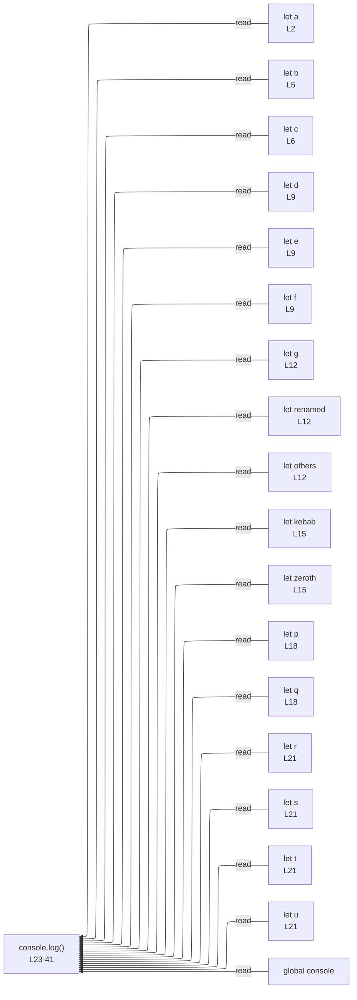

# integration/fixtures/let-binding-patterns/input.ts

## Input

```ts
// basic
let a = 0;

// multiple declarators
let b = 1,
  c = 2;

// array pattern + default + hole + rest
let [d = 100, , e, ...f] = [3, , 5, 6, 7];

// object pattern + rename + default + rest
let { g, h: renamed = 200, ...others } = { g: 8, h: 9, x: 10, y: 11 };

// non-identifier property name
let { "kebab-case": kebab, 0: zeroth } = { "kebab-case": 13, 0: 14 };

// nested (array inside object) + default
let { nested: [p = 0, q] = [] } = { nested: [15, 16] };

// nested (object inside array)
let [{ r, s = 0 }, [t, u]] = [{ r: 1, s: 2 }, [3, 4]];

console.log(
  a,
  b,
  c,
  d,
  e,
  f,
  g,
  renamed,
  others,
  kebab,
  zeroth,
  p,
  q,
  r,
  s,
  t,
  u,
);
```

## Mermaid


