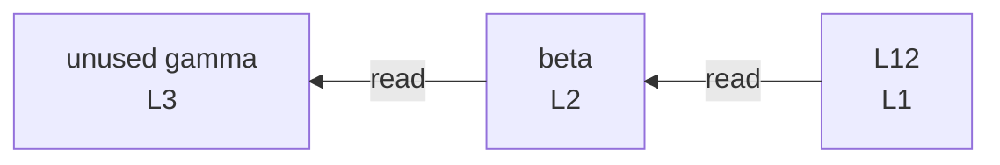

# integration/fixtures/lprefix-exact-match/input.ts

## Input

```ts
const L12 = 1;
const beta = L12 + 2;
const gamma = beta * 3;
```

## Query

```sh
-r L1-3 -C 1
```

## Mermaid


```mermaid
%%{init: {"flowchart": {"defaultRenderer": "elk"}}}%%
flowchart RL
  %% pruning roots L1-3=3 ancestors=1 descendants=1
  n_scope_0_L12_6["L12<br/>L1"]
  n_scope_0_beta_21["beta<br/>L2"]
  n_scope_0_gamma_43["unused gamma<br/>L3"]
  n_scope_0_L12_6 -->|read| n_scope_0_beta_21
  n_scope_0_beta_21 -->|read| n_scope_0_gamma_43
```
