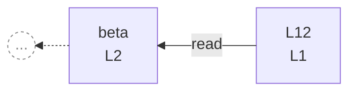

# integration/fixtures/lprefix-exact-match/input.ts

## Notice

```
uns: 'L12' is ambiguous.
  An exact identifier match was found; interpreting as identifier.
  To disambiguate, use '-r 12'.
```

## Input

```ts
const L12 = 1;
const beta = L12 + 2;
const gamma = beta * 3;
```

## Query

```sh
-r L12 -C 1
```

## Mermaid


