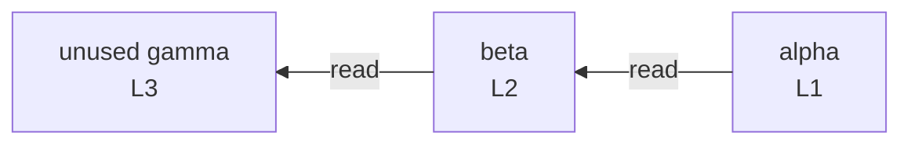

# integration/fixtures/lprefix-no-collision/input.ts

## Input

```ts
const alpha = 1;
const beta = alpha + 2;
const gamma = beta * 3;
```

## Mermaid


```mermaid
%%{init: {"flowchart": {"defaultRenderer": "elk"}}}%%
flowchart RL
  n_scope_0_alpha_6["alpha<br/>L1"]
  n_scope_0_beta_23["beta<br/>L2"]
  n_scope_0_gamma_47["unused gamma<br/>L3"]
  n_scope_0_alpha_6 -->|read| n_scope_0_beta_23
  n_scope_0_beta_23 -->|read| n_scope_0_gamma_47
```
