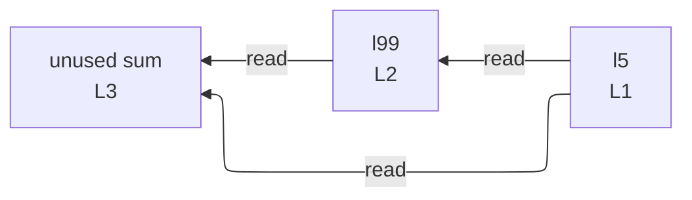

# integration/fixtures/lprefix-other-match/input.ts

## Input

```ts
const l5 = 1;
const l99 = l5 + 2;
const sum = l5 + l99;
```

## Mermaid


```mermaid
%%{init: {"flowchart": {"defaultRenderer": "elk"}}}%%
flowchart RL
  n_scope_0_l5_6["l5<br/>L1"]
  n_scope_0_l99_20["l99<br/>L2"]
  n_scope_0_sum_40["unused sum<br/>L3"]
  n_scope_0_l5_6 -->|read| n_scope_0_l99_20
  n_scope_0_l5_6 -->|read| n_scope_0_sum_40
  n_scope_0_l99_20 -->|read| n_scope_0_sum_40
```
