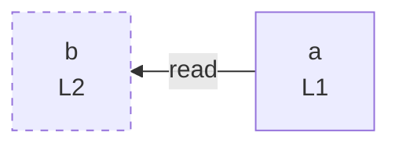

# minimal-const-array

## Input (`input.ts`)

```ts
const a = "a";
const b = [a];
```

## Mermaid


```mermaid
flowchart RL
  n_scope_0_a_6["a<br/>L1"]
  n_scope_0_b_21["b<br/>L2"]
  n_scope_0_a_6 -->|read| n_scope_0_b_21
  classDef unused stroke-dasharray: 5 5;
  class n_scope_0_b_21 unused;
```
