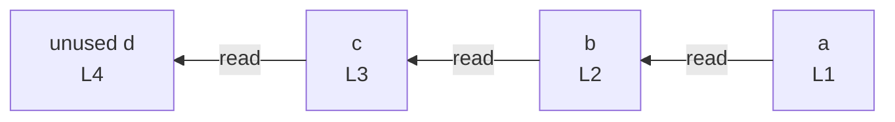

# integration/fixtures/minimal-const-chain/input.ts

## Input

```ts
const a = "a";
const b = [a];
const c = { value: b };
const d = c;
```

## Mermaid


```mermaid
%%{init: {"flowchart": {"defaultRenderer": "elk"}}}%%
flowchart RL
  n_scope_0_a_6["a<br/>L1"]
  n_scope_0_b_21["b<br/>L2"]
  n_scope_0_c_36["c<br/>L3"]
  n_scope_0_d_60["unused d<br/>L4"]
  n_scope_0_a_6 -->|read| n_scope_0_b_21
  n_scope_0_b_21 -->|read| n_scope_0_c_36
  n_scope_0_c_36 -->|read| n_scope_0_d_60
```
