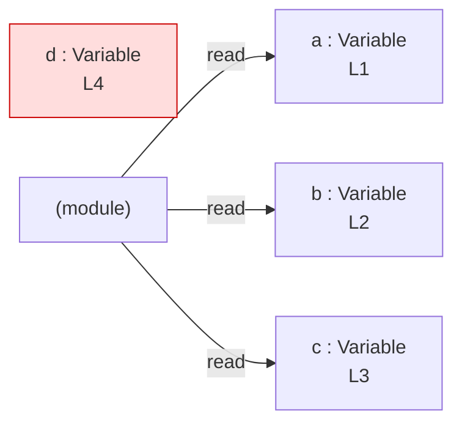

# minimal-const-chain

## Input (`input.ts`)

```ts
const a = "a";
const b = [a];
const c = { value: b };
const d = c;
```

## Mermaid


```mermaid
flowchart LR
  n_scope_0_a_6["a : Variable\nL1"]
  n_scope_0_b_21["b : Variable\nL2"]
  n_scope_0_c_36["c : Variable\nL3"]
  n_scope_0_d_60["d : Variable\nL4"]
  module_root -->|read| n_scope_0_a_6
  module_root -->|read| n_scope_0_b_21
  module_root -->|read| n_scope_0_c_36
  module_root["(module)"]
  classDef unused fill:#fdd,stroke:#c00;
  class n_scope_0_d_60 unused;
```
