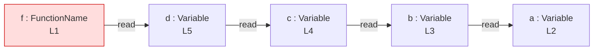

# minimal-function-chain

## Input (`input.ts`)

```ts
function f() {
  const a = "a";
  const b = [a];
  const c = { value: b };
  const d = c;
  return d;
}
```

## Mermaid


```mermaid
flowchart LR
  n_scope_0_f_9["f : FunctionName\nL1"]
  n_scope_1_a_23["a : Variable\nL2"]
  n_scope_1_b_40["b : Variable\nL3"]
  n_scope_1_c_57["c : Variable\nL4"]
  n_scope_1_d_83["d : Variable\nL5"]
  n_scope_1_b_40 -->|read| n_scope_1_a_23
  n_scope_1_c_57 -->|read| n_scope_1_b_40
  n_scope_1_d_83 -->|read| n_scope_1_c_57
  n_scope_0_f_9 -->|read| n_scope_1_d_83
  classDef unused fill:#fdd,stroke:#c00;
  class n_scope_0_f_9 unused;
```
