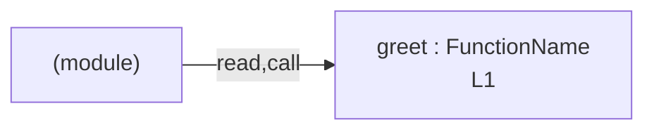

# minimal-function

## Input (`input.ts`)

```ts
function greet() {
  return "hi";
}
greet();
```

## Mermaid


```mermaid
flowchart LR
  n_scope_0_greet_9["greet : FunctionName\nL1"]
  module_root -->|read,call| n_scope_0_greet_9
  module_root["(module)"]
```
