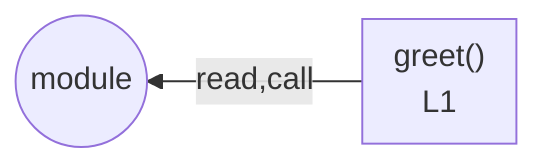

# integration/fixtures/minimal-function/input.ts

## Input

```ts
function greet() {
  return "hi";
}
greet();
```

## Mermaid


```mermaid
flowchart RL
  subgraph n_scope_0_greet_9["greet()<br/>L1"]
    direction RL
  end
  n_scope_0_greet_9 -->|read,call| module_root
  module_root((module))
```
