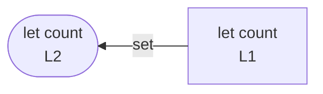

# integration/fixtures/minimal-let/input.ts

## Input

```ts
let count = 0;
count = 1;
```

## Mermaid


```mermaid
%%{init: {"flowchart": {"defaultRenderer": "elk"}}}%%
flowchart RL
  n_scope_0_count_4["let count<br/>L1"]
  wr_ref_0(["let count<br/>L2"])
  n_scope_0_count_4 -->|set| wr_ref_0
```
